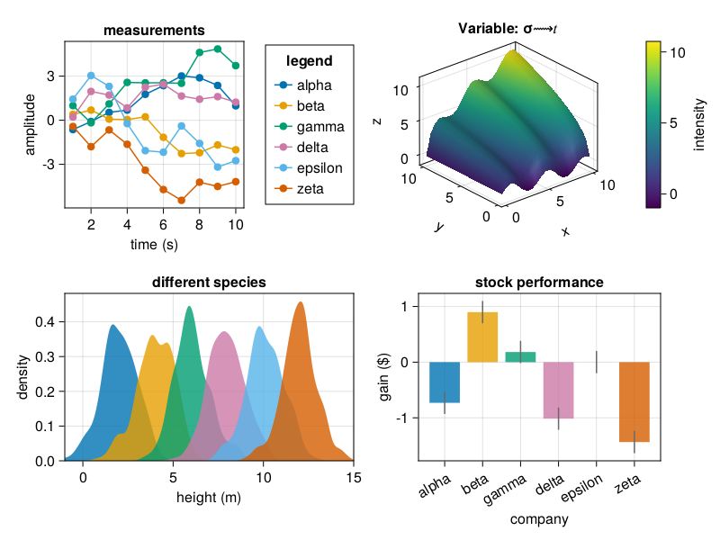
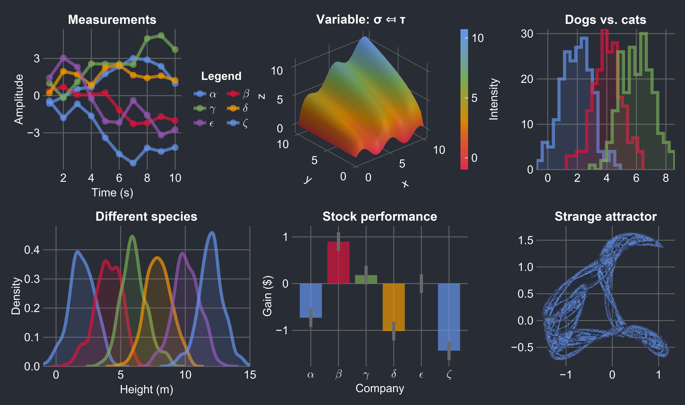
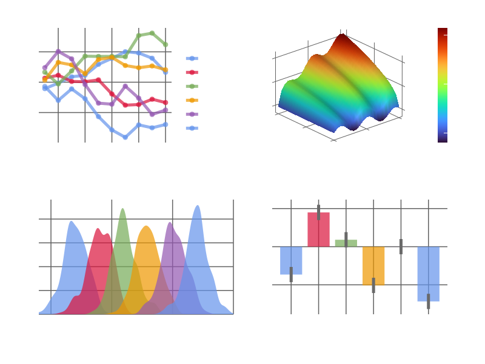
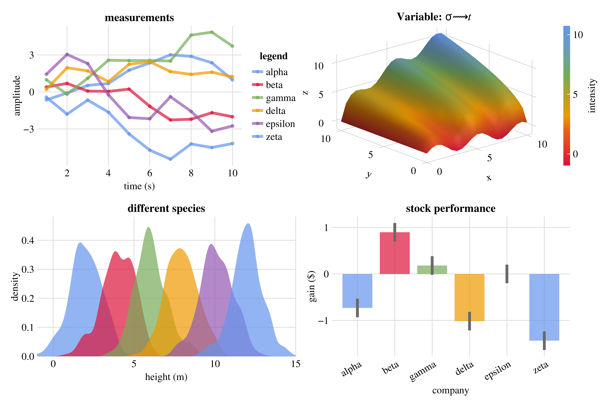

# Foresight.jl

[](https://brendanjohnharris.github.io/Foresight.jl/stable/)
[](https://brendanjohnharris.github.io/Foresight.jl/dev/)
[](https://github.com/brendanjohnharris/Foresight.jl/actions/workflows/CI.yml?query=branch%3Amain)
[](https://codecov.io/gh/brendanjohnharris/Foresight.jl)

A Makie theme. And some cool utilities.
# Usage
```Julia
using CairMakie
using Foresight
foresight() |> Makie.set_theme!
fig = Foresight.demofigure()
```


## Theme options
Any combination of the keywords below can be used to customise the theme.
### Dark
```Julia
foresight(:dark) |> Makie.set_theme!
fig = Foresight.demofigure()
```


### Transparent
```Julia
foresight(:dark, :transparent) |> Makie.set_theme!
fig = Foresight.demofigure()
```


### Serif
```Julia
foresight(:serif) |> Makie.set_theme!
fig = Foresight.demofigure()
```



# Utilities

### seethrough

Converts a color gradient into a transparent version.

```julia
C = cgrad(:viridis)
transparent_gradient = seethrough(C)
```

### widen

Slightly widens an interval by a fraction δ.

```julia
x = (0.0, 1.0)
wider_interval = Foresight.widen(x, 0.1)
```

### freeze!

Freezes the axis limits of a Makie figure.
```julia
fig, ax, plt = scatter(rand(10), rand(10))
freeze!(ax)
```

### clip

Copies a Makie figure to the clipboard.
```julia
fig = Figure()
scatter!(fig[1, 1], rand(10), rand(10))
clip(fig)
```

### @importall

Imports all symbols from a module into the current scope. Use with caution.
```julia
@importall(Foresight) .|> eval
```

### hidexaxis! and hideyaxis!

Hides the x-axis or y-axis, respectively, of a given axis object.
```julia
fig, ax, plt = scatter(rand(10), rand(10))
hidexaxis!(ax)
hideyaxis!(ax)
```

### gtkshow

Displays a CairoMakie scene, axis, figure, or FigureAxisPlot in a new GTK window. If Gtk is loaded, this is the default display method for CairoMakie figures. Useful for X-forwarding CairoMakie outputs from e.g. a remote cluster.
```julia
using CairoMakie, Gtk
using Foresight
scene = CairoMakie.Scene()
gtkshow(scene)
```

