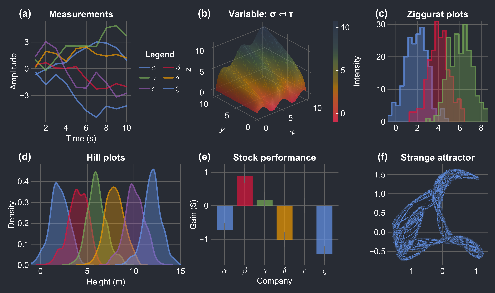
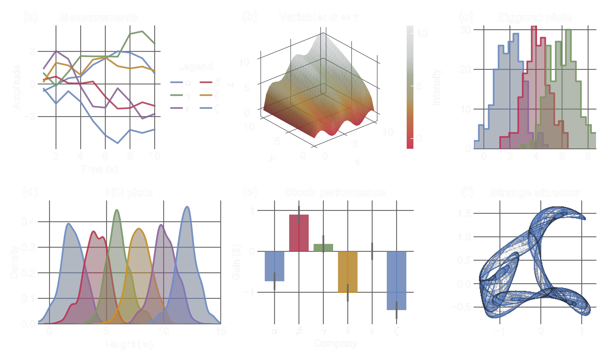
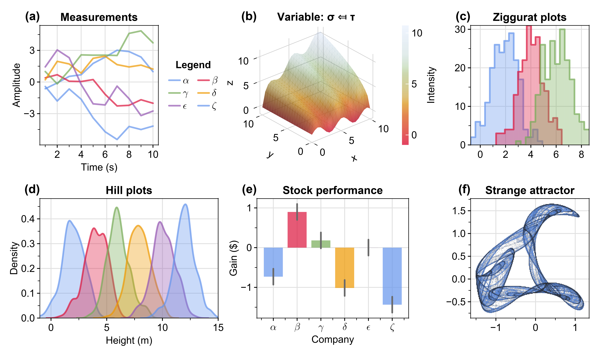

# Foresight.jl

[](https://brendanjohnharris.github.io/Foresight.jl/stable/)
[](https://brendanjohnharris.github.io/Foresight.jl/dev/)
[](https://github.com/brendanjohnharris/Foresight.jl/actions/workflows/CI.yml?query=branch%3Amain)
[](https://codecov.io/gh/brendanjohnharris/Foresight.jl)
[](https://doi.org/10.5281/zenodo.14511387)

A Makie theme. And some cool utilities.
# Usage
```Julia
using CairoMakie
using Foresight
foresight() |> Makie.set_theme!
fig = Foresight.demofigure()
```


## Theme options
Any combination of the keywords below can be used to customise the theme.
### Dark
```Julia
foresight(:dark, :transparent) |> Makie.set_theme!
fig = Foresight.demofigure()
```


### Transparent
```Julia
foresight(:dark, :transparent) |> Makie.set_theme!
fig = Foresight.demofigure()
```


### Serif
```Julia
foresight(:serif) |> Makie.set_theme!
fig = Foresight.demofigure()
```


### Physics
```Julia
foresight(:physics) |> Makie.set_theme!
fig = Foresight.demofigure()
```


# Utilities

### addlabels!

Add labels to a provided grid layout, automatically searching for blocks to label.

```julia
f = Foresight.demofigure()
addlabels!(f)
display(f)
```

### seethrough

Converts a color gradient into a transparent version.

```julia
C = cgrad(:viridis)
transparent_gradient = seethrough(C)
```

### scientific

Generate string representation of a number in scientific notation with a specified number of significant digits.

```julia
scientific(1/123.456, 3) # "8.10 × 10⁻³"
```

There is also an `lscientific` method, which returns a LaTeX string:
```julia
lscientific(1/123.456, 3) # "8.10 \\times 10^{-3}"
```

### brighten and darken

Brighten a color by a given factor by blending it with white:

```julia
brighten(:cornflowerblue, 0.2) # Brightens the color by 20%
```

Or, darken a color by blending it with black:
```julia
darken(:cornflowerblue, 0.2) # Darkens the color by 20%
```

### widen

Slightly widens an interval by a fraction δ.

```julia
x = (0.0, 1.0)
wider_interval = Foresight.widen(x, 0.1)
```

### freeze!

Freezes the axis limits of a Makie figure.
```julia
fig, ax, plt = scatter(rand(10), rand(10))
freeze!(ax)
```

### clip

Copies a Makie figure to the clipboard.
```julia
fig = Figure()
scatter!(fig[1, 1], rand(10), rand(10))
clip(fig)
```

### @importall

Imports all symbols from a module into the current scope. Use with caution.
```julia
@importall(Foresight) .|> eval
```

### hidexaxis! and hideyaxis!

Hides the x-axis or y-axis, respectively, of a given axis object.
```julia
fig, ax, plt = scatter(rand(10), rand(10))
hidexaxis!(ax)
hideyaxis!(ax)
```

# Colors
The theme is based on the colors `[cornflowerblue, crimson, cucumber, california, juliapurple]`:


It also provides the following colormaps:
#### sunrise

#### cyclicsunrise

#### sunset

#### darksunset

#### lightsunset

#### binarysunset

#### cyclic

#### pelagic


# Recipes
The following recipes are exported:

### ziggurat

A transparent stepped histogram, shown in the demo figure above.

### hill

A transparent kernel density plot, shown in the demo figure above.

### prism

Colors a positive definite matrix according to its eigendecomposition.


### covellipse

Plot an ellipse representing a given covariance matrix.


